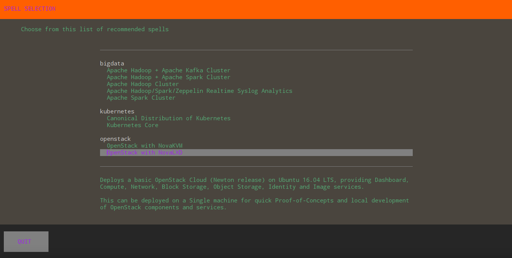
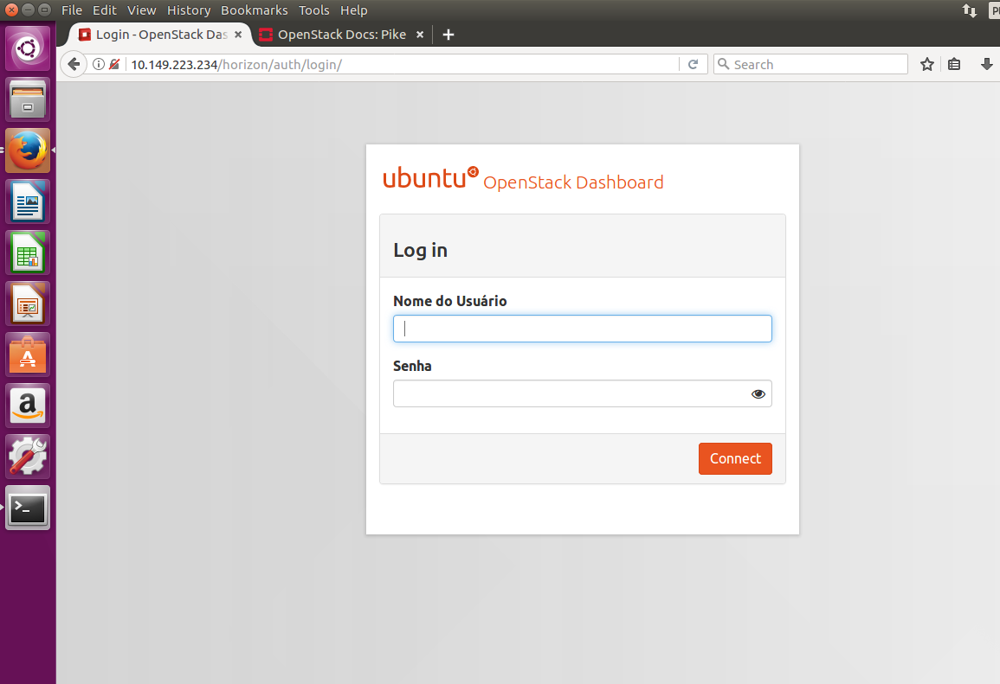

# openstack_single_machine_lxd
Implementação fácil e rápida do OpenStack com conjure-up em um único laptop usando contêineres LXD. É ideal para usuários ou desenvolvedores pela primeira vez em contato com a instalação do Openstack. 

Baseado em [https://www.ubuntu.com/download/cloud/try-openstack](https://www.ubuntu.com/download/cloud/try-openstack), com adição de alguns pontos que acredito terem faltado no tutorial básico da Canonical.

Primeiramente desinstalar qualquer versão do LXD do repositório:
```sh
apt remove --purge lxd lxd-client
```

Adicionar o usuário lxd:
```sh
sudo groupadd --system lxd
```

Adicionar o usuário desejado ao grupo lxd:
```sh
sudo usermod -G lxd -a user
```

Instalar o lxd via snap (não via repositório):  
```sh
sudo snap install lxd
```

Execute o newgroup:
```sh
newgrp lxd
```

**Fazer logout e logar novamente na sessão do usuário (se estiver via ssh, só sair e conectar novamente)**:

Inicie o LXD:
```sh
/snap/bin/lxd init --auto
```

Crie uma rede:
```sh
/snap/bin/lxc network create lxdbr0 ipv4.address=auto ipv4.nat=true ipv6.address=none ipv6.nat=false
```

Instale o conjure-up:
```sh
sudo snap install conjure-up --classic
```

Execute o conjure-up:
```sh
conjure-up
```

Escolha a opção "OpenStack with NovaLXD" e siga as instruções. Esse procedimento é bastante demorado dependendo do hardware utilizado.



Acesse pelo navegador o URL informado no final da instalação. http://<openstack ip>/horizon logue com o username padrão “admin” e password “openstack”.
  
  
